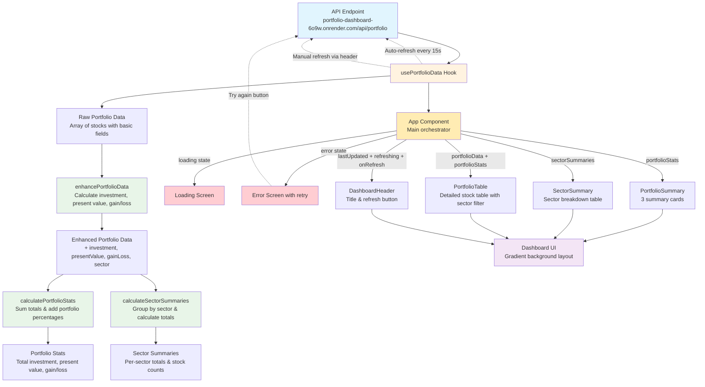

# Portfolio Dashboard

A dynamic portfolio dashboard built with React, TypeScript, Tailwind CSS, and Node.js, designed to track stocks in real-time using custom APIs.

## Project Overview

This dashboard fetches CMP, P/E ratios, and latest earnings using APIs built from Yahoo Finance and Google Finance data sources. The backend is hosted on Render for reliable access: `https://portfolio-dashboard-6o9w.onrender.com/api/portfolio`. It provides interactive tables, summaries, and sector-level analysis for better portfolio management.

### Key Features

* Real-time portfolio updates every 15 seconds
* Portfolio summary: Total Investment, Present Value, Gain/Loss
* Sector-wise summaries with gain/loss indicators
* Interactive holdings table with filters by sector
* Visual indicators for gains (green) and losses (red)
* Modern, responsive UI built with Tailwind CSS and Shadcn-UI
* Fetching and processing data directly from real Excel files using `read-excel-file/node`

### Tech Stack

* **Frontend:** React, TypeScript, Vite, Shadcn-UI
* **Backend:** Node.js, Express (hosted on Render)
* **Styling:** Tailwind CSS
* **APIs:** Custom APIs using Yahoo Finance and Google Finance

### Installation

```bash
# Clone the repository
git clone https://github.com/your-username/portfolio-dashboard.git
cd portfolio-dashboard

# Install dependencies
npm install

# Start the development server
npm run dev
```

### Usage

* Open `http://localhost:5173` in your browser
* Refresh the portfolio using the dashboard button to fetch the latest stock data from the hosted API
* Filter stocks by sector to see detailed sector-level summaries

### Key Challenges Faced

* Fetching and processing portfolio data directly from an Excel sheet
* Creating a custom backend API to handle and serve this data
* Retrieving current market price (CMP), P/E ratio, and latest earnings from Yahoo Finance and Google Finance, which required handling unofficial APIs and scraping methods
* Developing custom hooks and utility functions for state management and calculations, which was extremely challenging

### Data Flow


